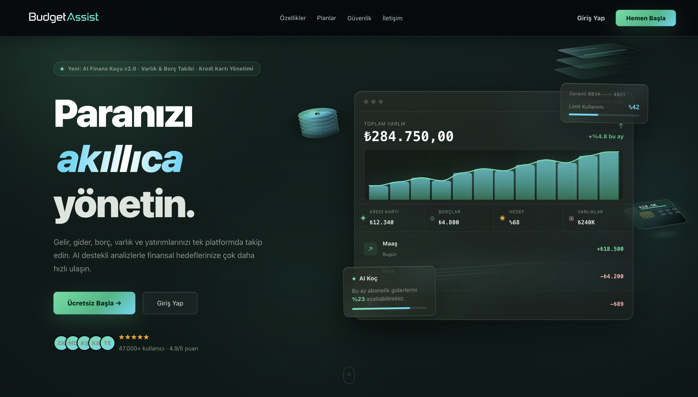
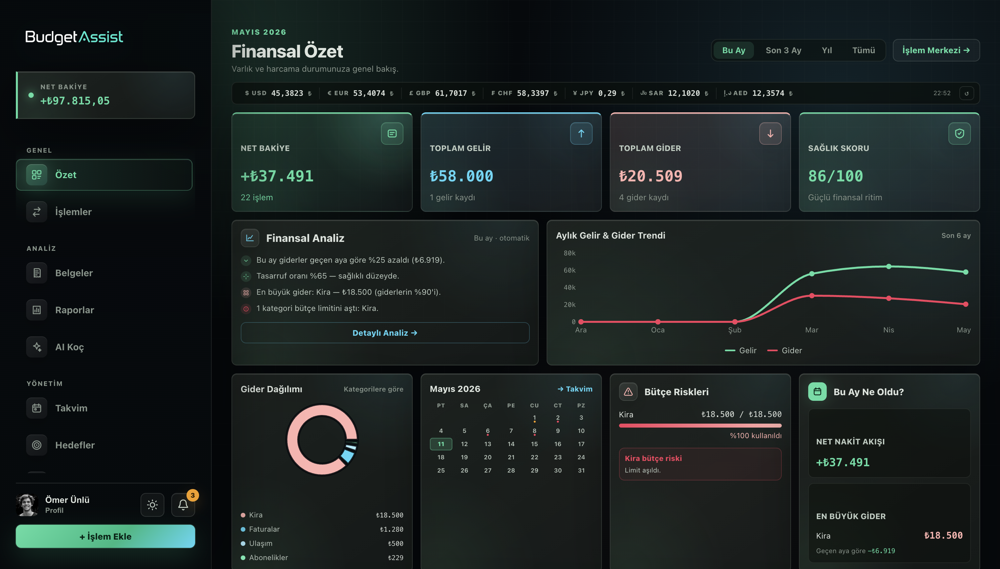
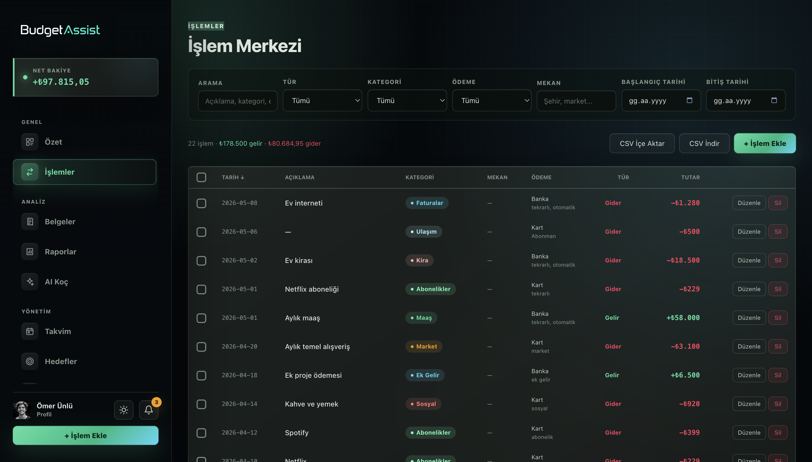
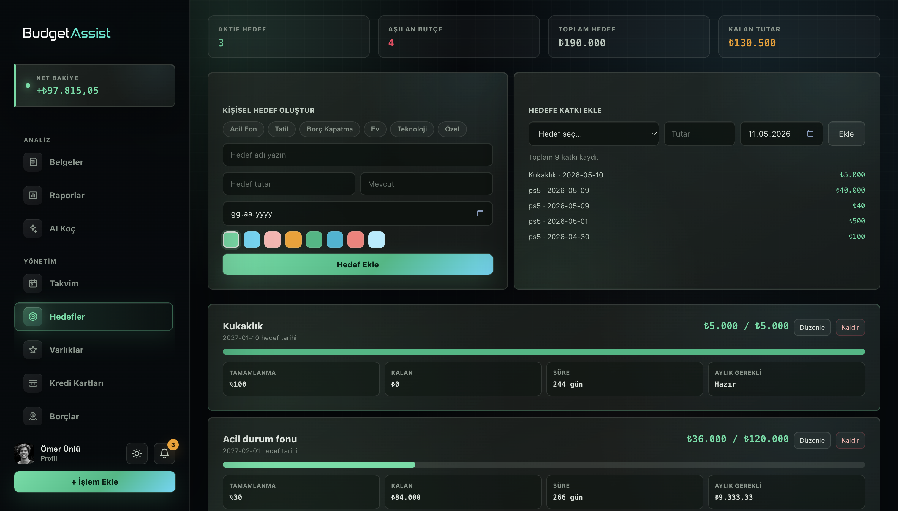
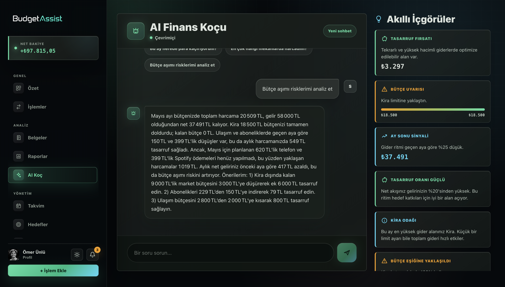
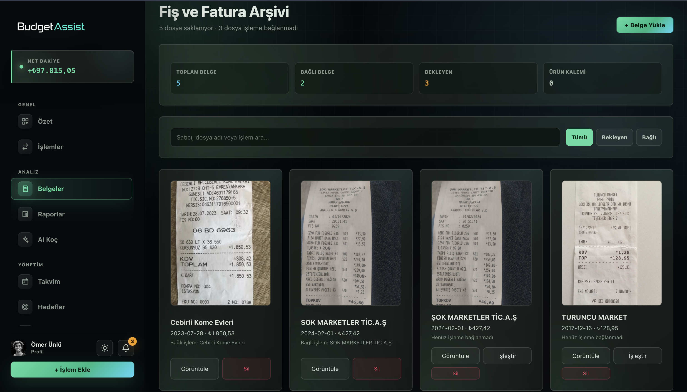
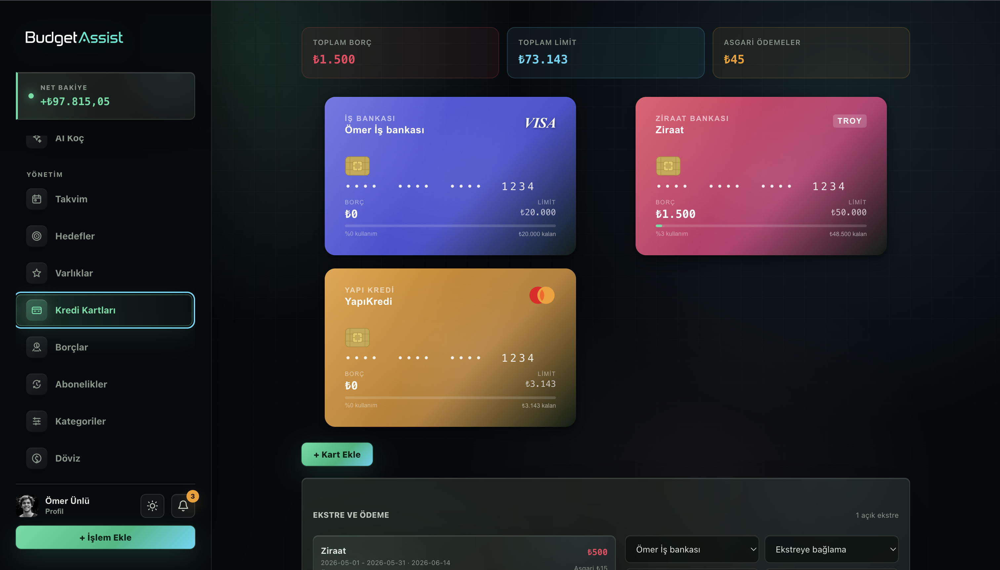
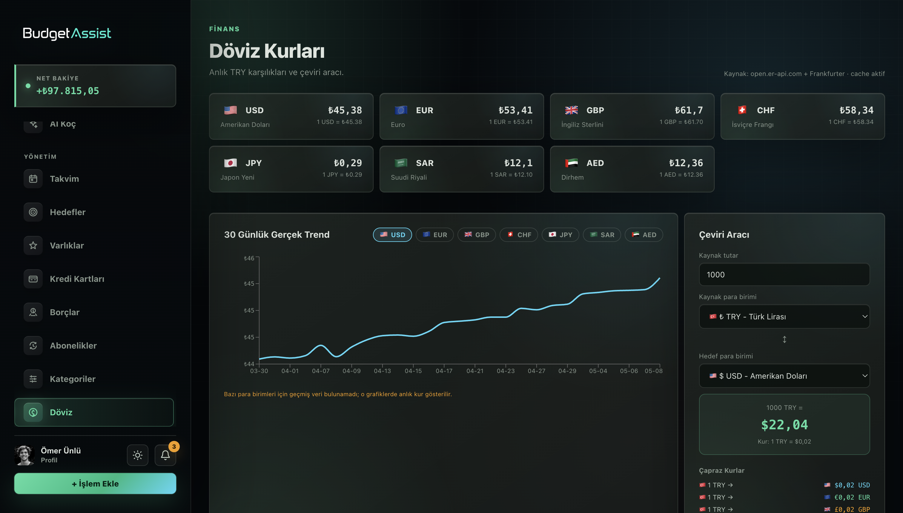

<div align="center">



# BudgetAssist

**Your complete personal finance command center.**

[](https://react.dev)
[](https://vitejs.dev)
[](https://supabase.com)
[](https://vitest.dev)
[](LICENSE)

</div>

---

## Overview

BudgetAssist is a production-grade personal finance management application that gives you absolute control over your money. Track every transaction, set meaningful financial goals, manage debts and investments, scan receipts with AI-powered OCR, and get personalized advice from a built-in AI Coach — all wrapped in a sleek dark-glassmorphism interface inspired by the **"Quiet Luxury"** design philosophy.

---

## Table of Contents

- [Features](#features)
- [Screenshots](#screenshots)
- [Tech Stack](#tech-stack)
- [Getting Started](#getting-started)
- [Environment Variables](#environment-variables)
- [Project Structure](#project-structure)
- [Design System](#design-system)
- [Testing](#testing)
- [Contributing](#contributing)
- [License](#license)

---

## Features

### Core Finance
- **Transaction Management** — Add, edit, delete income and expenses with full filtering, sorting, and CSV import/export
- **Custom Categories** — Create spending categories with icons, colors, and monthly budget limits
- **Budget Tracking** — Real-time budget utilization with visual alerts when limits are approached or exceeded
- **Financial Health Score** — Automated score calculated from your income-to-expense ratio and goal progress

### Planning & Goals
- **Financial Goals** — Set savings targets, track contributions, and visualize progress toward each goal
- **Recurring Rules** — Define templates for repeating transactions (rent, salary, subscriptions) so they auto-populate
- **Budget Calendar** — Monthly calendar view showing transactions plotted on each day for a timeline perspective

### Advanced Tracking
- **Receipt Scanner** — Upload receipt images; AI (Groq/Llama) extracts merchant, amount, date, and category automatically
- **Subscription Manager** — Track recurring subscriptions, see monthly cost totals, and get renewal reminders
- **Debt Manager** — Register debts, log payments, and mark them as settled with a full payment history
- **Credit Cards** — Manage multiple credit cards, track statements, and monitor payment due dates
- **Investment Portfolio** — Add assets (stocks, crypto, real estate), record buy/sell transactions, and capture snapshots over time

### Intelligence
- **AI Coach** — Conversational AI advisor powered by Groq; analyzes your financial data and answers questions about spending, budgeting, and savings strategies
- **Smart Category Suggestions** — Merchant name heuristics auto-suggest the correct category when adding transactions
- **Notification System** — Proactive alerts for budget overruns, upcoming bill due dates, and goal milestones

### Reporting & Export
- **Analytics Dashboard** — Income vs. expense bar charts, category donut charts, monthly trend lines
- **Detailed Reports** — Period-based breakdowns with per-category drill-down
- **Currency Converter** — Real-time exchange rates for multi-currency tracking
- **CSV Export / Import** — Export all transactions or bulk-import from a spreadsheet

### Platform
- **Admin Panel** — Platform-level user management, account suspension, and usage analytics
- **Multi-theme** — Light and dark mode with a single toggle
- **Supabase Auth** — Secure email/password authentication with user profiles and avatar uploads

---

## Screenshots

### Landing Page


### Dashboard


### Transactions


### Financial Goals


### AI Coach


### Receipt Scanner


### Credit Cards


### Currency Rates


---

## Tech Stack

| Layer | Technology | Version |
|---|---|---|
| UI Framework | React | 18.3 |
| Build Tool | Vite | 8.0 |
| Backend / Auth / DB | Supabase | 2.104 |
| Data Visualization | Recharts | 2.12 |
| AI (Receipt OCR + Coach) | Groq (Llama 4) | — |
| Testing | Vitest + Testing Library | 4.1 |
| DOM Environment | jsdom | 29 |
| CI | GitHub Actions | — |

---

## Getting Started

### Prerequisites

- [Node.js](https://nodejs.org) 18 or higher
- npm (comes with Node.js)
- A free [Supabase](https://supabase.com) account

### Installation

```bash
git clone https://github.com/your-username/BudgetAssist.git
cd BudgetAssist
npm install
```

### Environment Setup

Copy the example environment file and fill in your credentials:

```bash
cp .env.example .env.local
```

Open `.env.local` and set the required variables (see [Environment Variables](#environment-variables) below).

### Run the Development Server

```bash
npm run dev
```

The app will be available at `http://localhost:5173`.

### Build for Production

```bash
npm run build
npm run preview   # preview the production build locally
```

---

## Environment Variables

| Variable | Required | Description |
|---|---|---|
| `VITE_SUPABASE_URL` | Yes | Your Supabase project URL (e.g. `https://xxxx.supabase.co`) |
| `VITE_SUPABASE_PUBLISHABLE_KEY` | Yes | Your Supabase `anon` public key |
| `GROQ_API_KEY` | Optional | Groq API key — enables AI Coach and Receipt OCR (set as a Supabase Edge Function secret, not in `.env.local`) |
| `RESEND_API_KEY` | Optional | [Resend](https://resend.com) API key — enables email notifications |
| `TWILIO_ACCOUNT_SID` | Optional | Twilio SID — enables SMS notifications |
| `TWILIO_AUTH_TOKEN` | Optional | Twilio auth token |
| `TWILIO_FROM_NUMBER` | Optional | Twilio sender phone number |

> **Security note:** `GROQ_API_KEY`, `RESEND_API_KEY`, and Twilio secrets should be stored as **Supabase Edge Function secrets**, not in your frontend `.env.local` file.

---

## Project Structure

```
BudgetAssist/
├── public/                  # Static assets
├── src/
│   ├── components/          # Feature modules (one folder per feature)
│   │   ├── Dashboard/       # Overview charts & health score
│   │   ├── Transactions/    # CRUD + CSV import/export
│   │   ├── Categories/      # Custom categories with budgets
│   │   ├── Goals/           # Financial goals & contributions
│   │   ├── Reports/         # Analytics & period reporting
│   │   ├── Calendar/        # Transaction calendar view
│   │   ├── Receipts/        # OCR receipt scanning & archive
│   │   ├── Subscriptions/   # Recurring payment tracker
│   │   ├── Debts/           # Debt & payment management
│   │   ├── CreditCards/     # Credit card statements
│   │   ├── Assets/          # Investment portfolio
│   │   ├── AiCoach/         # Conversational AI advisor
│   │   ├── Currency/        # Real-time exchange rates
│   │   ├── Notifications/   # Alert center
│   │   ├── RecurringRules/  # Recurring transaction templates
│   │   ├── Account/         # User profile & avatar
│   │   ├── Admin/           # Platform administration
│   │   ├── Auth/            # Login & registration
│   │   ├── Plans/           # Subscription tiers
│   │   └── ui/              # Shared UI primitives (Card, Modal, etc.)
│   ├── hooks/
│   │   ├── useAuth.js       # Authentication state
│   │   └── useTheme.js      # Light/dark theme
│   ├── services/
│   │   ├── budgetService.js # Core finance operations (Supabase)
│   │   ├── assetService.js  # Portfolio & asset data
│   │   ├── currencyService.js
│   │   ├── notificationService.js
│   │   └── adminService.js
│   ├── utils/
│   │   ├── finance.js       # Health score, totals, category math
│   │   ├── categorySuggestions.js
│   │   └── helpers.js
│   ├── App.jsx              # Root component & router
│   └── main.jsx             # Entry point
├── supabase/
│   └── migrations/          # Database schema migrations
├── docs/
│   ├── screenshots/         # Place your screenshots here
│   ├── test-plan.md
│   ├── test-cases.md
│   └── test-summary.md
├── DESIGN.md                # Full design system reference
├── .env.example             # Environment variable template
└── package.json
```

---

## Design System

BudgetAssist uses the **"Luminous Wealth"** design language — a dark glassmorphism aesthetic that conveys sophistication without noise.

| Token | Value | Usage |
|---|---|---|
| Emerald `#4edea3` | Primary | Growth, positive cash flow |
| Cyan `#4cd7f6` | Secondary | Savings, investments |
| Rose `#f43f5e` | Danger | Expenses, over-budget |
| Amber `#f59e0b` | Warning | Alerts, near-limit |
| Navy `#05090d` | Background | App canvas |

- **Typography:** Plus Jakarta Sans (UI text) · JetBrains Mono (numbers & financial data)
- **Layout:** 8 px grid, generous whitespace, translucent glass cards with subtle luminescent borders
- **Motion:** Smooth transitions on all interactive elements

For the full specification see [DESIGN.md](DESIGN.md).

---

## Testing

```bash
npm test               # watch mode
npm run test:run       # single run (CI)
npm run test:coverage  # coverage report
npm run test:ui        # Vitest UI dashboard
```

Tests cover financial calculation utilities and React component logic. See the full test documentation:

- [Test Plan](docs/test-plan.md)
- [Test Cases](docs/test-cases.md)
- [Test Summary](docs/test-summary.md)

CI runs automatically on every push via GitHub Actions.

---

## Contributing

1. Fork the repository
2. Create a feature branch: `git checkout -b feat/your-feature`
3. Commit your changes: `git commit -m "feat: add your feature"`
4. Push to the branch: `git push origin feat/your-feature`
5. Open a Pull Request

Please follow the existing code style and add tests for any new logic.

---

## License

This project is licensed under the [MIT License](LICENSE).

---

<div align="center">
Made with care for people who take their finances seriously.
</div>
